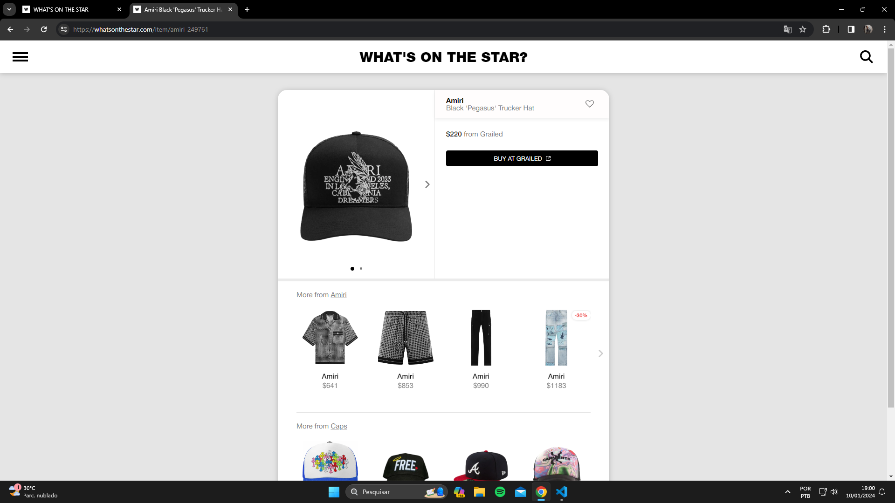

# Informações Gerais

## Objetivo

Clonar o site "What's On The Star", que divulga para o público quais roupas/acessórios os artistas ou personalidades influentes dos mais variados nichos estão vestindo/usando e onde podem ser compradas.

- Site oficial: [What's on the Star](https://whatsonthestar.com/)

## Motivação

A princípio a ideia era aprofundar os conhecimentos de frontend que aprendi durante meus estudos colocando em prática em um projeto que tenha minha identidade, como grande apreciador da cultura do streetwear, sneakers e rap, decidi clonar o site "What's On The Star" mas mudando o foco para exclusivamente artistas e influencers brasileiros que fazem parte desses nichos.

## Observações

Eu iniciei o desenvolvimento desse site muito tempo atrás e ele acabou ficando de lado, meu foco é voltar a trabalhar nele melhorando continuamente todos os pontos que eu conseguir identificar, já que meu conhecimento evoluiu com o tempo.

- Não pretendo clonar todas as funcionalidades, meu foco não é colocar o site em produção e sim testar conhecimento prático.

## Pontos principais para melhoria

- Estrutura.
- Roteamento.
- Usar CSS modules para evitar conflito de classes.
- Fluxo de erro.
- Simplificar algumas lógicas.
- Separar a lógica dos componentes em Custom Hooks.
- Adicionar mais dados para serem consumidos.
- Usar uma outra maneira de mockar os dados. Ex: json server

## Imagens

- Clone

- Original

